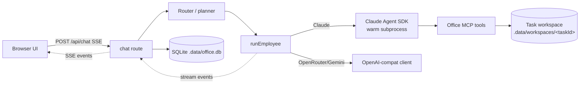
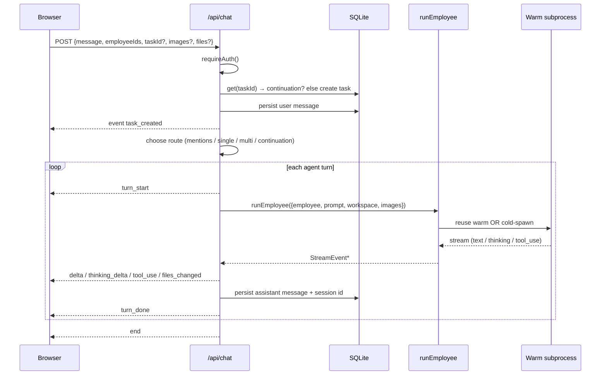
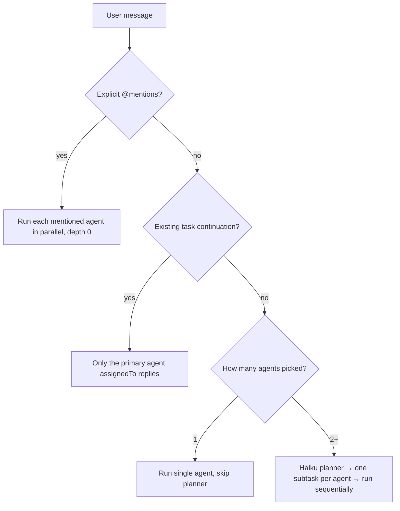
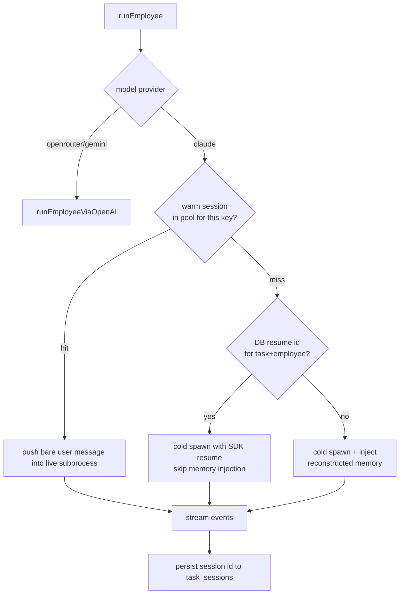

# Architecture

How Penguin turns one chat message into a coordinated, multi-agent run that streams back to the browser and ships real files. This document covers the request lifecycle, agent routing, the warm session pool, prompt assembly, memory and resume, tools, and storage.

## High-level

Penguin is a single Next.js process. The browser talks to API routes; the routes drive AI agents through the **Claude Agent SDK** (for Claude models) or an **OpenAI-compatible client** (for OpenRouter / Gemini). Each agent runs as a long-lived CLI subprocess kept warm in an in-process pool. State lives in a local SQLite database and a per-task workspace folder on disk.



Key source files:

| Concern | File |
|---|---|
| Request lifecycle, routing, SSE | `app/api/chat/route.ts` |
| Multi-agent planner | `lib/orchestrator.ts` |
| Agent runner (provider dispatch) | `lib/claude.ts` |
| OpenRouter / Gemini backend | `lib/openai-compat.ts` |
| Warm subprocess pool | `lib/session-pool.ts` |
| System prompt assembly | `lib/employee-prompt.ts` |
| Per-task memory transcript | `lib/memory.ts` |
| File tools exposed to agents | `lib/office-mcp.ts` |
| Persistence | `lib/db.ts` |

## Request lifecycle

Everything funnels through one streaming endpoint: `POST /api/chat`. It authenticates, opens a Server-Sent Events stream, and emits typed events (`task_created`, `turn_start`, `delta`, `thinking_delta`, `tool_use`, `files_changed`, `turn_done`, `plan`, `invite_request`, `end`, `error`, `stopped`) that the UI renders live.



A few details worth knowing:

- **Optimistic task ids.** The client may generate the `taskId` so it can navigate into the new room immediately. The route treats "did the task already exist?" as the source of truth for continuation, not "did the client send an id?".
- **Abort is wired end to end.** `req.signal` feeds an `AbortController` passed into the SDK; aborting a turn closes the warm subprocess (see pooling).
- **Vision input.** Pasted screenshots and uploaded images are saved to the workspace and sent as image content blocks on the agent's first turn. Attached `.pptx` / `.pdf` design references are rendered to per-page PNGs and fed through the same vision path (as inspiration, not templates).
- **Title generation.** New tasks get a short title from a cheap Haiku call, fired and forwarded as `task_titled` without blocking the main run.

## Agent routing

Once the user message is persisted, the route picks exactly one of four strategies:



- **Explicit `@mentions`** are the loudest routing signal: the mentioned agents run in parallel.
- **Continuation** in a multi-agent room defaults to the primary agent (`task.assignedTo`); use `@Name` to direct a different member.
- **Multi-agent new chat** runs the planner (`lib/orchestrator.ts`): a cheap Haiku call decomposes the task into exactly one subtask per picked agent (the user's selection is mandatory, with a safety net that re-adds any agent the planner dropped). Agents then run **sequentially**, each one seeing prior outputs inlined into its prompt, so the work builds up instead of producing parallel paragraphs that ignore each other.

### Mention cascade and invite gating

When an agent's reply `@mentions` someone, the route decides whether to cascade or ask the user:

- If the mentioned agent is **already in the room** (picked, user-mentioned, or seen in history), it auto-handoffs as a follow-up turn, up to `MENTION_CHAIN_LIMIT` (2) deep.
- If the mentioned agent is **new to the room**, the route emits an `invite_request` and waits for user approval instead of cascading. Each target is invited at most once per request.
- The **Prompt Master** (`isPromptEngineer = 1`) is never auto-pulled into a room. It only replies in a direct one-on-one chat.

## The agent runner

`runEmployee()` in `lib/claude.ts` is the single entry point for running one agent turn. It is an async generator that yields `StreamEvent`s.



Non-Claude models are routed to the OpenAI-compatible backend (`lib/openai-compat.ts`, OpenRouter endpoint). A `modelOverride` (used for utility passes) is always a Claude model and keeps that pass on the Agent SDK.

## Warm session pool

The Claude Agent SDK spawns a `claude` CLI subprocess on every `query()`, which costs ~1-2s (and several seconds cold). To match Claude Code's "always warm" feel, `lib/session-pool.ts` keeps one live `Query` per key and pushes follow-up turns into it via an `AsyncQueue` (the SDK's streaming-input pattern). System prompt, tools, and cwd are set once at session creation and reused.

Three regimes share the pool, distinguished by key:

| Regime | Key | Lifetime |
|---|---|---|
| Chat | `chat:<taskId>:<employeeId>` | One subprocess per conversation |
| Utility (planner, refine) | `util:<employeeId>:<model>` | Shared across tasks; stateless one-shots |
| Pre-warm | same chat key, spawned idle | Picked up by the next real turn |

Mechanics:

- **Options signature.** Each pooled session records the signature of the options it was created with (model + tools + cwd + mode). A reuse request with a different signature evicts and recreates, so a mode change (workspace toggled, model swapped) never reuses a mismatched subprocess.
- **Busy guard.** A session in mid-turn is not reused concurrently; the caller falls back to a fresh one-shot.
- **Pre-warming.** When the user picks an agent or opens a task, the UI calls `/api/warm`, which spawns the subprocess idle so the cold cost is paid during typing. The pre-warm options **must mirror** the real chat options (workspace + tools), or the signature mismatch wastes the warm subprocess.
- **Idle reaper.** A timer closes sessions idle longer than `IDLE_MS` (10 min) to free subprocesses; it's `unref`'d so it never keeps the process alive.
- **Abort = close.** Aborting a turn closes the session; the next turn spins up fresh.
- **Crash safety.** If a subprocess dies mid-stream, the session is dropped from the pool so the next turn starts clean.
- **Windows handle release.** Before deleting a task's workspace folder, `dropSessionsByTask()` closes any subprocess holding that cwd open, avoiding `EPERM` on `rmSync`.

## System prompt assembly

The system prompt is split into a **static prefix** and a **dynamic suffix** around the SDK's cache boundary marker, so the prefix is prompt-cached across turns and sessions (`lib/employee-prompt.ts`).

```
[ static prefix ]                         ← cached
  persona (employee.systemPrompt)
  + skills block (skill-gated)
  + conversation rules (address, tone, format, mention rules)
  + workspace tools block (when tools are on)
  + file-routing rule (non-Aria agents route file creation through Aria)
--- SYSTEM_PROMPT_DYNAMIC_BOUNDARY ---
[ dynamic suffix ]                        ← per task
  workspace path + uploaded-file list
```

- **Conversation rules** are generated from the user profile: how to address the user, matching Vietnamese self-reference pronouns, a hard length cap (concise / balanced / detailed), formatting rules (full Vietnamese diacritics in all user-facing text, an em-dash / en-dash ban), and mention syntax.
- **Skill-gating.** Skills attached to an employee inject their prompt text, and design tools (`export_dashboard`, slide tools) are only documented to agents who hold the `design-slides` skill, so an agent never hallucinates a tool it doesn't have.
- **File routing.** Every non-Aria agent is told to route all file creation through Aria by replying `@Aria` with the full content; Aria is the only agent that calls file-writing tools, keeping output style consistent.
- **Utility passes** (`bareForUtility`) get only the bare persona. The 2-sentence cap and "no markdown" rules would otherwise corrupt structured output like planner JSON.

## Memory and resume

An agent regains context one of three ways, in priority order (`lib/claude.ts`):

1. **Warm pool hit** — the live subprocess already holds the full conversation; only the new user message is pushed. No memory injection.
2. **SDK resume** — on a cold spawn, if `task_sessions` has a stored `sessionId` for this `(taskId, employeeId)`, the SDK resumes that transcript from disk. No memory injection.
3. **Reconstructed memory** — otherwise, `lib/memory.ts` builds a transcript from the SQLite message history (scoped to this task, filtered to messages this agent sent / received / was mentioned in, plus all user messages), prepended to the prompt.

Resume is self-healing: if SDK resume fails (transcript missing, app folder moved so the cwd-derived project path changed) and nothing has streamed yet, the turn clears the stale id and transparently retries cold with reconstructed memory. The now-null resume id prevents an infinite retry loop.

Memory is intentionally **per-task**: a new task does not pull history from unrelated tasks. The roster is always re-snapshotted so agents use current names even if someone was renamed after old messages were written.

## Tools

When a workspace is attached (always, for chat), Claude agents get the SDK's `Read / Write / Edit / Bash / Glob / Grep / WebFetch / WebSearch / NotebookEdit` plus an **Office MCP server** (`lib/office-mcp.ts`) scoped to the task workspace:

| Tool | Purpose |
|---|---|
| `export_pdf`, `export_docx` | Markdown → PDF / Word |
| `xlsx_write`, `read_xlsx` | Write / read Excel (styled preset, formula-safe) |
| `read_pdf`, `read_docx`, `read_text`, `write_text`, `edit_text` | Read / write documents |
| `export_dashboard` | BI dashboard HTML (Chart.js) — skill-gated |
| `slide_template`, `pptx_inspect_template`, `pptx_export` | Slide deck workflow — skill-gated |

The OpenRouter / Gemini backend gets the office tools only (no shell or filesystem), with bare tool names for function calling. The SDK backend prefixes them `mcp__office__` and suppresses the office text tools that duplicate native `Read/Write/Edit`. Per-task workspaces live under `.data/workspaces/<taskId>`; relative paths from agents resolve into that folder, and external MCP tools (`pencil`, `figma`, `claude_ai`) are explicitly disallowed.

### Slides → PPTX export

Decks are authored as self-contained HTML (the 20 built-in templates under `templates/`). Native PPTX export (`lib/office-tools/html-to-pptx-native.ts`) renders the HTML in headless Edge, extracts boxes / text / charts as editable native objects, screenshots complex shapes as images, and embeds the deck's fonts. Image export rasterizes each slide to one picture for pixel-perfect fidelity.

## Storage

SQLite via `node:sqlite` (`lib/db.ts`), file at `.data/office.db`:

| Table | Holds |
|---|---|
| `employees` | Agent persona, role, model, skills, emoji/color, live `sessionId` |
| `tasks` | Task title, status, mode, `assignedTo` (primary agent) |
| `messages` | Chat history (role, from/to, content, mentions, images, files) |
| `task_sessions` | Per `(task, employee)` SDK resume id for cross-restart continuity |
| `settings` | User profile, API keys, response style, overridable rules |
| `custom_skills`, `skill_overrides` | User-defined skills and edits to built-in ones |

Generated files live on disk in the per-task workspace, not in the database. Nothing leaves the machine except the calls to the chosen model provider.

## Models and providers

Model ids are parsed (`lib/models.ts`) into a provider + model name. Claude ids run through the Agent SDK under the machine's Claude Code login (no separate API key needed). OpenRouter ids run through the OpenAI-compatible endpoint using the key saved in Settings. An employee's model is configurable per agent; utility passes (planner, title) pin a cheap Haiku model regardless.
