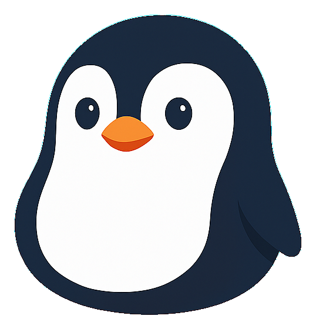

<p align="center">
  
</p>

<h1 align="center">Penguin</h1>

<p align="center">
  <strong>A local-first, multi-agent workspace.</strong><br/>
  Delegate complex work to a coordinated team of AI agents that plan, talk to each other, and ship real deliverables, PDF, Word, Excel, dashboards, and slide decks, all running on your own machine.
</p>

---

## What it is

Penguin is a desktop-style web app you run locally. Instead of chatting with a single assistant, you assemble a small team of specialist agents and hand them a task. They coordinate, pass work between each other with `@mentions`, and produce finished files you can open and use.

Everything runs on your machine. Your chats, tasks, and generated files live in a local `.data/` folder and are never sent anywhere except to the model provider you choose.

## Features

- **A coordinated agent team.** Pick one or several agents per chat. They reply in parallel, hand off subtasks to each other, and you can call any of them by name with `@AgentName`.
- **Two model backends.** Run agents on **Claude** (via a Claude Max or Pro login) or on **OpenRouter / Gemini** (via an API key). Mix both in the same workspace.
- **Real deliverables, not just text.** Agents write actual files: dashboards and reports (HTML), spreadsheets (Excel), documents (Word/PDF), and presentations (PPTX).
- **A built-in slide template library.** 20 ready-made deck templates with a live preview gallery. Generate a deck from a template, then fine-tune it in a **visual editor** (click to edit text, size, color, drag to reposition).
- **PPTX export, two ways.** Export decks as native, editable PowerPoint, or as high-fidelity image slides, with embedded fonts.
- **Spreadsheet discipline built in.** Every agent carries an Excel skill that enforces zero formula errors, formulas over hardcoded values, consistent number formatting, and text-safe handling of serial numbers / IMEI / phone numbers.
- **Fast, polished AI editing.** A warm subprocess pool pre-spawns on file open so edits return quickly, with a live overlay showing exactly which region is being worked on.
- **In-app updater.** Check for and install new versions from inside Settings. Your data is never touched on update.

## Requirements

- **Node.js 22+** — download the LTS build from <https://nodejs.org>.
- To run **Claude** agents: a machine signed in to Claude Code with a **Max** or **Pro** plan (run `claude` once to log in).
- To run **OpenRouter / Gemini** agents: an OpenRouter API key from <https://openrouter.ai/keys>, pasted into the app under Settings.

You only need one of the two model options to get started.

## Quick start

Open a terminal in this folder and run:

```bash
npm install
npm run dev
```

The first `npm install` takes a minute or two; later runs skip it. Then open <http://localhost:3000>.

> On Windows you can instead double-click **`start.bat`**, which installs (if needed) and launches in one step.

To stop: press `Ctrl + C` in the terminal, or run `stop.bat` on Windows.

## First run

1. Open <http://localhost:3000>. The left sidebar already lists the pre-configured agents.
2. Click **⚙ Settings** to set your name and how agents address you, and to paste an **OpenRouter API key** if you want non-Claude agents.
3. Click **+ New chat**, pick one or more agents, and describe your task. Selected agents answer in parallel; use `@AgentName` to direct follow-ups.
4. Click **Add agent** to create your own, or open an existing agent to edit it.

## The agent team

Penguin ships with a ready-made team you can use immediately or customize:

| Agent | Role |
|---|---|
| **Atlas** | Data Analyst, also handles actuarial work and spreadsheets |
| **Aria** | Senior Visual & Product Designer, dashboards, reports, slide decks, HTML mockups |
| **Scout** | Market Researcher (insurance focus) |
| **Forge** | Product Designer (insurance), coverage, pricing logic, distribution, claims |

You can add your own agents at any time, each with its own role, system prompt, model, and skills. A private **Prompt Master** is also available for one-on-one prompt refinement, and is never auto-pulled into group chats.

## Slides and PPTX export

Ask any design-capable agent for a slide deck. If you have not picked a template yet, the agent opens a **template menu**, a live preview gallery of the 20 built-in templates. Choose one (or go fully custom), and the agent builds the deck.

From there you can:

- **Edit visually.** Click any element to change its text, font size, and color, or drag to reposition and resize.
- **Export to PowerPoint.** Choose **native** (fully editable shapes and text with embedded fonts) or **image** (pixel-perfect slides). Export runs through an embedded Python runtime, no separate install needed in the packaged release.

## Updating

Updates can be installed without touching your data:

- **In-app (recommended).** Settings → **Update** tab → **Download & install** → **Restart Penguin**.
- **From a zip.** Settings → **Update** → drop a `Penguin_v*.zip` into the local-zip box.
- **Script (Windows).** Drop the zip next to `start.bat` and double-click `apply-update.bat`.

Your `.data/` folder (chats, generated files, saved login) is never modified during an update.

## Tech stack

Next.js 16 + TypeScript + Tailwind 4, `@anthropic-ai/claude-agent-sdk` for Claude agents, SQLite via `node:sqlite` for local storage, and an embedded Python runtime for document and slide export.

## Project layout

```
app/            Next.js routes and API endpoints
components/     React UI (chat, sidebar, file editor, template gallery)
lib/            Agent orchestration, session pool, DB, seed personas
templates/      Built-in slide templates and the preview gallery
scripts/        Build, packaging, and maintenance scripts
public/         Static assets (icons, fonts, mascot)
.data/          Local runtime data (created on first run, gitignored)
```

## Notes

- Each Claude turn spins up a background CLI process; the first turn in a task is a little slower while it warms up. OpenRouter models (e.g. Gemini Flash) respond faster.
- Penguin is an independent personal project and is not affiliated with or endorsed by Anthropic. Use of Claude models is subject to Anthropic's terms.

## License

Copyright (c) 2026 dovannam115. All rights reserved. The source is published for viewing and reference only; see [LICENSE](LICENSE) for terms.
